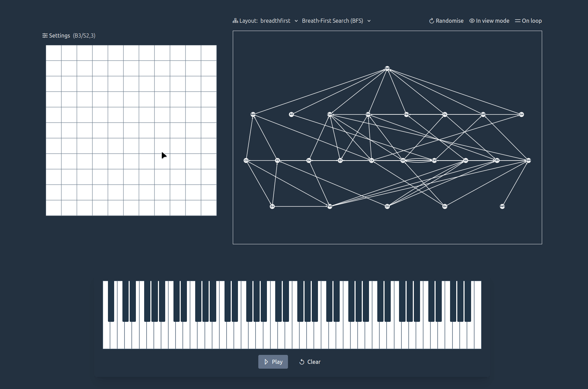

# AlgoMIDI 🎹

A musical studio to create music through cellular automata and graph traversal algorithms. Built as a spiritual successor to [Cellular Minimata](https://github.com/myanvoos/cellular-minimata) - now instead of simply visualising the automata, each "living" cell triggers a musical note.

Tech stack: Vue 3, Vite, TypeScript, Web Audio API (via Tone.js), p5.js, Cytoscape.js. The piano sampler came from [this](https://github.com/nbrosowsky/tonejs-instruments).

AlgoMIDI lets you create music through:

- 🎲 Conway's Game of Life (and other cellular automata rules)
- 🕸️ Graph traversal algorithms (BFS/DFS) 

A virtual piano represents the notes generated by both the cellular automata and the graph traversal algorithms.

## Features

### Cellular Automata
- Classic Game of Life rules (B3/S23) and other presets
- Custom rule input (format: B3/S2,3)
- Adjustable playback speed (60-240 BPM)
- Click cells to create initial patterns

### Graph Traversal 
- Visual representation of notes as nodes
- BFS and DFS algorithms to create melodic sequences
- Drag-and-drop edge creation
- Multiple layout options (circle, grid, random etc.)

### Piano Interface
- Visual feedback for played notes
- Shows notes from both automata and graph
- Basic playback controls
